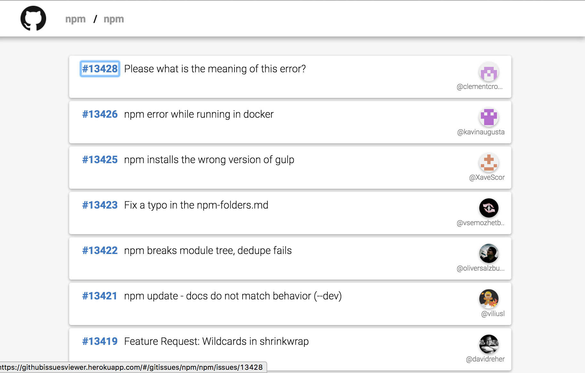
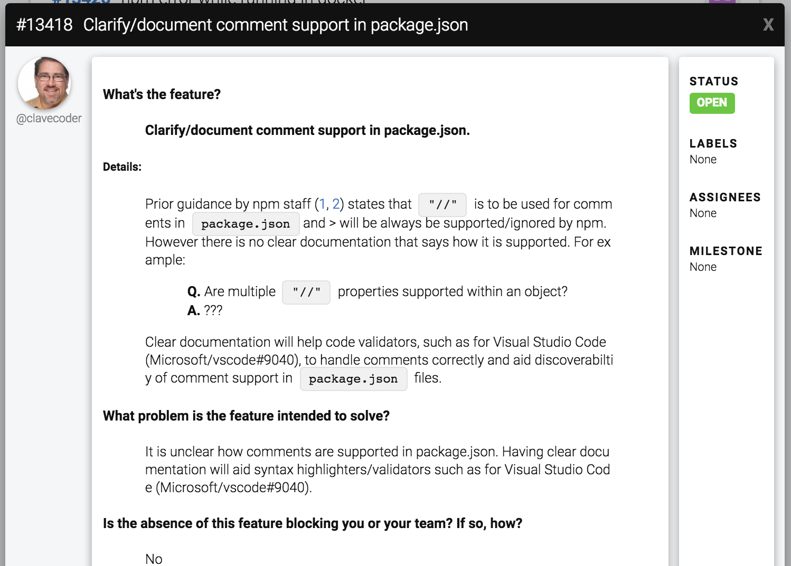

## Demo
https://githubissuesviewer.herokuapp.com/

Note: The heroku server sleeps when not in use. So when you launch it, it might take a while to start the server and then server the URL

## Screenshots

## Tech Stack
Node version v4.4.5
UI - React, Flux
URL - React Router
Unit Testing - mocha
UI Testing - mocha, selenium
Styling - SASS (scss), custom CSS, skeleton
Build - Webpack

## Testing production ready code
1. Install npm and in terminal, navigate to root folder "GithubIssuesViewer/" and run "npm install"  
2. [DONE] To update static assets for production, on terminal run "npm run prod-build"
3. Launch the local file from assets/index.html to do a sanity check before prod deploy
4. Alternatively run npm run start and launch localhost:5000 in the browser

## Running App in Development Mode
1. Install npm  
2. In terminal, navigate to root folder "GithubIssuesViewer/" and run "npm install" & "npm install --dev" (use sudo or sudo bash if necessary)
3. In terminal, navigate to root folder "GithubIssuesViewer/" and run "npm run start-dev"
4. Run http://localhost:8090 in browser

## Running tests
1. To run unit tests, run this on the terminal: 'mocha test/unit_tests/'

## Running selenium tests (default config is dev server)
1. Once development environment is set up, run 'npm run start' on the terminal from the same folder as the README. 
Note: This starts the dev server host, that the tests use to lauch the site and run. The test host can be configured to another url by changing the TestConstants file.
2. Next run 'mocha test/integration_tests/'.
Note: by default the tests are run using firefox. Make sure firefox is installed. You can change the browser to user in TestConstants file.

## Features
1. Default page URL:
    a. By default the url will be 'http://localhost:8090/#/gitissues/npm/npm/issues'
    b. Using the URL, we can change the repo user and repo name by using a url like this: 
        'http://localhost:8090/#/gitissues/dhiviyadhanasekar/GithubIssuesViewer/issues'
        where dhiviyadhanasekar is the repo user and 'GitIssuesViewer' is the repo name.

2. Repo name and user can also be changed in the UI header (next to the git logo), by click on the text, changing it and pressing enter or clicking anywhere out.

3. On default page, 
    a. hovering over issue number will show a preview of the first 140 characters of the issue body (ending on a clean line or word) - preview display on hover was done to avoid clutter on the default page.
    b. Clicking on reporter will link to the user's github page
    c. Clicking on the issue number will bring up the 'Issue Details Page'.

4. Issue Page URL:
    a. Issue page can reached by either clicking on the issue number on the default page or by directly using a url like: 'http://localhost:8090/#/gitissues/npm/npm/issues/13267', where 'npm/npm' is the user/repo and '13267' is the issue number

5. Responsive - designed to work on screens with different sizes

Project Scope Notes:
1. This project doesn't have Github oauth implementation and hence allows you to make up to 60 Github requests per hour.

